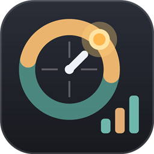

# ZoneQuanta



[中文](README.md) · **English**

**A Windows desktop world clock with a taskbar network / CPU / RAM monitor and per-app traffic statistics.** Shows local time and Los Angeles time (automatic DST), any of 36 popular cities, live upload / download speed in the taskbar, and how much traffic each application used. Lightweight WPF / .NET 8, one self-contained exe, signed auto-update.

> Keywords: world clock, time zone clock, DST, daylight saving time, Los Angeles time, desktop widget, taskbar monitor, network speed meter, upload download speed, bandwidth monitor, CPU usage, memory usage, per-app network traffic, data usage by app, Windows 10, Windows 11, WPF, .NET 8

## Features

| Feature | Details |
|---|---|
| Local + Los Angeles time | DST / standard time switches automatically using the Windows time zone database (per-year rules). Click a card to flip it: current state, next switch moment, this year's DST period (2026: Mar 8 02:00 – Nov 1 02:00), and today's sunrise / sunset / day length |
| 24-hour day ribbon | A ribbon across each card covering 0–24 h (one tick per hour, labelled 0 / 6 / 12 / 18 / 24): the daylight segment is computed per city from latitude and date (polar day / night included), the part of the day already gone is bright and the rest dimmed, a sun / moon marker sits on the current time, and sunrise / sunset times are printed on the ribbon; hover the ribbon to read any moment; cards tilt in 3D with a moving highlight; the desktop widget uses a compact layout (name + time + slim ribbon + key marks, about half the previous area) and flips on click for DST and sunrise / sunset details |
| Taskbar hover details | Rest the mouse on the taskbar monitor to see upload / download / total speed with a live chart, today's traffic, adapter and link rate, CPU usage with cores / processes / threads, memory used / available / committed, uptime and today's top apps |
| Popular countries and cities | 36 built-in cities (USA, Canada, China, Japan, Europe, Australia, ...), plus search over every system time zone. Up to 4 zones, renamable and reorderable |
| Taskbar monitor | Placed at the far left of the taskbar by default; choose "left of Start" or "left of the notification area" and fine-tune the offset. Height adapts to the taskbar with no padding. Upload speed, download speed, total speed, memory % and CPU % can each be switched on or off |
| Speed units | Bytes `B` or bits `b`; unit auto (B → KB → MB → GB) or fixed K / M / G |
| Per-app traffic | Upload / download per application over: today, 24 hours, this week, this month, this year, all time. Live speed chart and animated bars |
| Desktop widget | Click-through, always on top, lock position, may extend past screen edges, auto-hide when a full-screen app runs |
| Start with Windows | Per-user startup entry, no administrator rights needed |
| Look and feel | Four eye-friendly low-saturation themes; rolling digits, card flip, hover and page transitions (2D animation), all optional |
| Tray and hotkey | Left-click the tray icon to show / hide the panel; right-click for common switches; global hotkey `Ctrl + Alt + Z` by default; right-click the ZoneQuanta area on the taskbar to open settings too |
| Auto-update | Parallel multi-mirror download, ECDSA signature + SHA-256 verification |
| Low footprint | Second-aligned timer, redraws only what changes; about 0.3% of one CPU core and ~75 MB RAM when idle |

## Install

Download `ZoneQuanta.exe` (about 165 MB) from [Releases](https://github.com/Aevorine/ZoneQuanta/releases/latest) and double-click it. **The .NET runtime and every dependency are built in — nothing else to install.**

On first run you choose an install location. **Pick any folder; the app always installs into a `ZoneQuanta` folder inside it** (choose `D:\Apps` and it installs to `D:\Apps\ZoneQuanta`). A desktop shortcut and start-with-Windows are optional. The exe is not code-signed, so SmartScreen may warn about an unknown publisher: choose "Run anyway".

## Per-app traffic and administrator rights

Windows only lets administrators read per-process network events, so this feature is **optional**. Turning it on in the Traffic page triggers one system authorization and creates a scheduled task `ZoneQuantaTraffic` that runs a small helper with administrator rights (ETW `Microsoft-Windows-Kernel-Network`; it records only process names and byte counts, never content). Turning the switch off deletes the task. Without it you still get total traffic and live speed.

With a local proxy or TUN adapter, traffic is attributed to the proxy process.

## Usage

- Left-click the tray icon to open / close the panel; the taskbar entry disappears when it is closed
- Eight pages: Console, Display, Time zones, Monitor, Traffic, Window, System, Update
- Settings, logs and statistics live in `%APPDATA%\ZoneQuanta`

## Architecture

```
src/ZoneQuanta
├── Core        pure logic, no UI dependency
│   ├── Settings   settings model and persistence
│   ├── Time       time zones, DST, sunrise / sunset (astronomical), city catalog, second-aligned ticker
│   ├── Monitor    network / CPU / memory sampling, unit conversion, traffic store
│   ├── Traffic    elevated statistics helper (ETW) and scheduled-task launcher
│   └── Update     manifest verification, parallel download, update coordinator
├── Platform    Win32 wrappers: window styles, full-screen detection, hotkey, autostart
├── Shell       tray icon
├── UI          Theme, Controls, Widget, Band (taskbar monitor), Setup (installer), Panel
└── AppController  composition root
```

## Build

Requires the .NET 8 SDK: `dotnet build src/ZoneQuanta -c Release`. The release flow is `scripts/release.ps1` (build, sign, create the Release, keep only the latest two). The signing key is not in this repository.

## License

MIT
